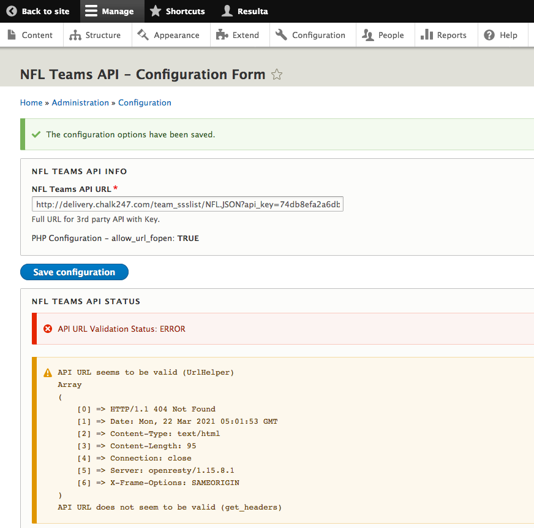
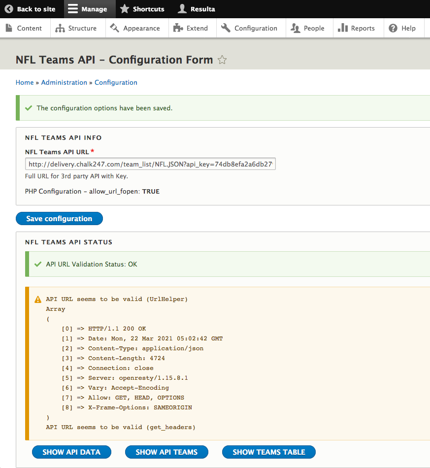
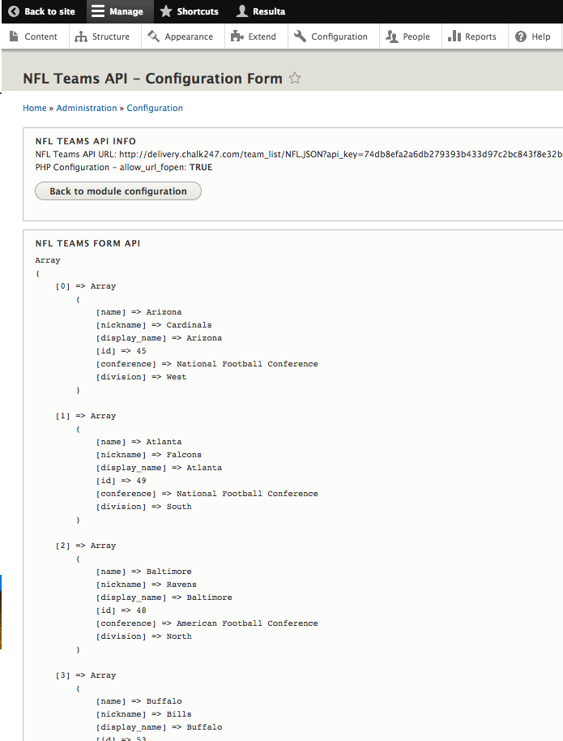
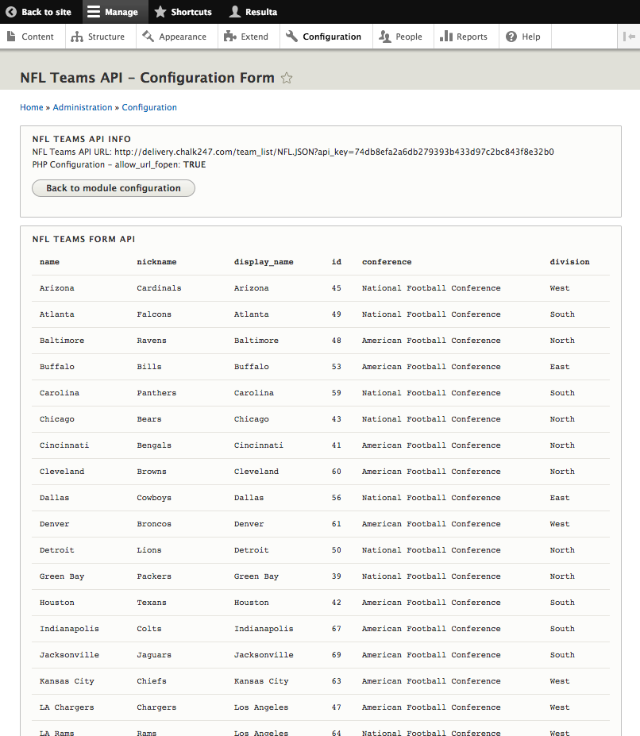

# NON STABLE - Work In Progress - WIP!

# NFL Teams
The NFL Team module ia custom module for Drupal 8. Module provides integration with 3rd party API.

This is experimental module and I would not recommend to deploy to live site without more work and review.

## Current Features
- Provides API configuration
- Provides API URL check
- Allows to review API data

# Screenshots

NFL Teams Configuration - Invalid URL

NFL Teams Configuration - Valid URL

NFL Teams Configuration - Teams array from JSON API

NFL Teams Configuration - Teams HTML table data from JSON API

## TO DO! Features
- Import all NFL teams from 3rd party API into custom NFL Team content type and show all teams in a block.

## Dependencies
- This module is using only Drupal 8 core features such as Content Types, Views, Taxonomies, HTTP Client and Blocks

## Getting Started
- Download module and place into modules/custom directory
- To install: Go to Admin -> Extend and enable custom module

## Configuration
- You will need to provide 3rd party API full URL, including KEY as parameter.
- Configuration:  Go to `/admin/config/nfl_teams/settings` and enter full 3rd party API URL.

- Now you are ready to go!

## Installed components
- After you enable/install this module, following Drupal components will be created:
1. Taxonomies
TO DO! List of components - so far only install taxonomy vocabulary.
All other work is now done in admin section/form where API tests are provided as well.

## Uninstall
- This module currently does not offer clean path to uninstall.
  It means removing module will still leave DB objects behind.
